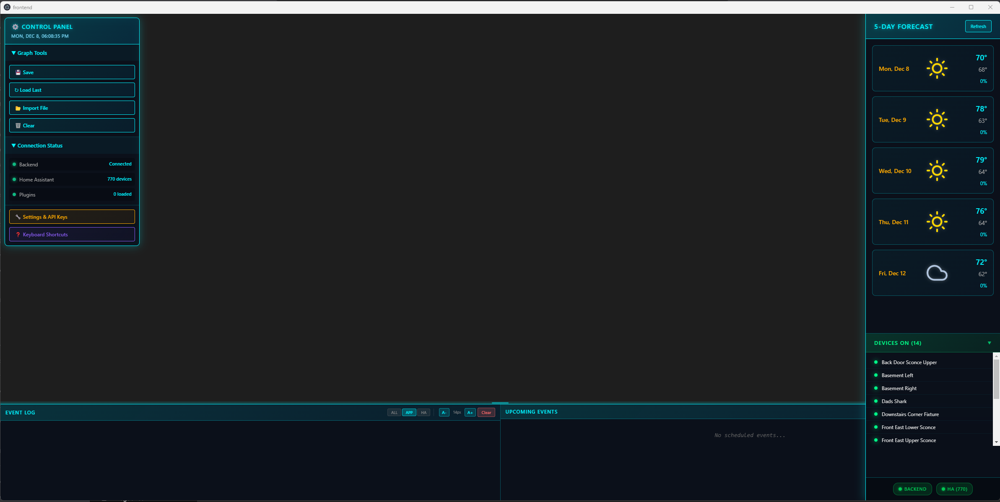
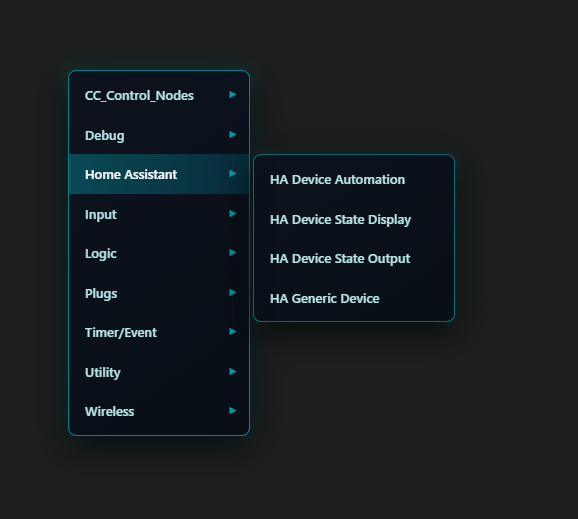
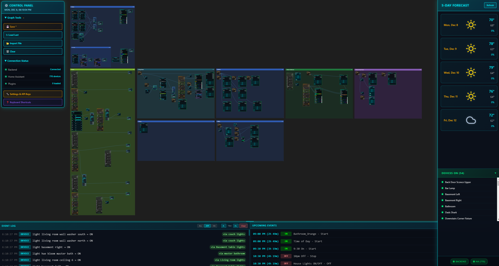
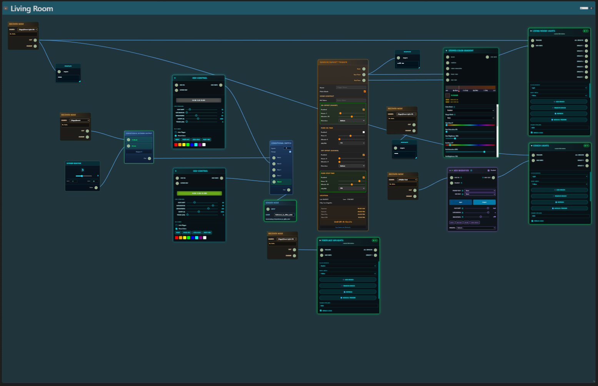
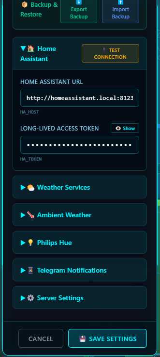

# T2AutoTron 2.1

[](https://github.com/gregtee2/T2AutoTron/actions)
[](LICENSE)
[](https://github.com/gregtee2/T2AutoTron/releases)
[](https://open.vscode.dev/gregtee2/T2AutoTron)




**T2AutoTron is a modern, visual node-based automation editor for Home Assistant and smart devices. Build powerful automations with drag-and-drop simplicity—no coding required. Supports real-time device control, advanced logic, and instant integration with Home Assistant, Philips Hue, Kasa, and more. Built with React, Rete.js v3, and Node.js.**

---

## Why Use T2AutoTron?

- **No coding required:** Build automations visually, just connect nodes.
- **Instant device discovery:** Home Assistant integration finds all your devices automatically.
- **Extensible:** Add new node types at runtime—no rebuild needed.
- **Real-time dashboard:** See device status, weather, and events live.
- **One-click install:** Windows/Mac/Linux scripts, or manual setup.
- **Open source:** MIT licensed, ready for community contributions.

---

## 🚀 Quick Start

**Requirements:** Windows 10/11, macOS, or Linux

### Step 1: Download

**Option A: ZIP Download (Easiest)**
1. Download: [T2AutoTron-stable.zip](https://github.com/gregtee2/T2AutoTron/archive/refs/heads/stable.zip)
2. Extract to a folder (e.g., `C:\T2AutoTron`)

**Option B: Git Clone (For Developers)**
```bash
git clone https://github.com/gregtee2/T2AutoTron.git
cd T2AutoTron
```

### Step 2: Install

**Windows:** Double-click `install.bat`

**Mac/Linux:**
```bash
chmod +x install.sh && ./install.sh
```

> ⏱️ First install takes 1-2 minutes. Node.js is installed automatically if needed.

### Step 3: Run

**Windows:** Double-click `start_servers.bat`

**Mac/Linux:**
```bash
./start_servers.sh
```

The app opens in an Electron desktop window. 

### Step 4: Configure

1. Click the **⚙️ Settings** gear icon
2. Enter your **Home Assistant URL** (e.g., `http://homeassistant.local:8123`)
3. Enter your **Home Assistant Token** ([How to get a token](https://www.home-assistant.io/docs/authentication/#your-account-profile))
4. Click **Test Connection** → should show green checkmark
5. Click **Save**

### Step 5: Update (Anytime)

**Windows:** Double-click `update.bat`

**Mac/Linux:**
```bash
./update.sh
```

> 🔄 Works like ComfyUI - one click to update! Automatically installs Git if needed and converts ZIP downloads to Git-enabled.

---

## 📁 File Reference

| File | Purpose |
|------|---------|
| `install.bat` / `install.sh` | One-click installer (installs Node.js + dependencies) |
| `start_servers.bat` / `start_servers.sh` | **Recommended** - Launches backend + Electron app |
| `start.bat` / `start.sh` | Alternative - Launches backend + browser (tab may sleep) |
| `update.bat` / `update.sh` | One-click updater (auto-converts ZIP to Git) |

---

## 🔗 Links & Community

- 📖 [Getting Started Guide](v3_migration/GETTING_STARTED.md) - Step-by-step tutorial
- 🔧 [Node Development Guide](v3_migration/frontend/RETE_NODE_GUIDE.md) - Create custom nodes
- 🧩 [Plugin Architecture](v3_migration/PLUGIN_ARCHITECTURE.md) - Extend T2AutoTron
- 🐛 [Issues & Feature Requests](https://github.com/gregtee2/T2AutoTron/issues)
- 💬 [Discussions](https://github.com/gregtee2/T2AutoTron/discussions)

---

## Features

### Visual Node Editor
Build automations by connecting nodes visually - no coding required.



### 37+ Node Types
- **Device Control**: Home Assistant, Philips Hue, TP-Link Kasa
- **Logic**: AND, OR, XOR, Comparison, Conditional Switch
- **Timing**: Time of Day, Time Range, Sunrise/Sunset, Delay, Debounce
- **Color**: HSV Control, Color Gradient, All-In-One Color Picker
- **Utility**: Debug, Display, Sender/Receiver for cross-graph communication

### Automation Flows
Create complex automations with visual flows connecting triggers, logic, and device control.



### Organize with Backdrops
Group related nodes into zones for better organization.



### Settings & API Keys
Configure all your integrations in one place with connection testing.



### Real-Time Dashboard
- 5-Day Weather Forecast
- Device Status (14 devices shown ON)
- Event Log with filtering
- Connection Status indicators

---

## Architecture
- **Rete.js v3**: Complete migration from LiteGraph to Rete.js v3
- **React Components**: All nodes are now React components with proper state management
- **Vite Build System**: Fast development with HMR (Hot Module Replacement)
- **Modern Socket System**: Type-safe socket connections with custom compatibility layer
- **Plugin Architecture**: Extensible node system - add new nodes without rebuilding

## Working Features
- ✅ **37+ Node Types**: Full suite of automation nodes
- ✅ **HAGenericDeviceNode**: Home Assistant device control with Follow mode
- ✅ **Logic Nodes**: AND, OR, XOR, Comparison, Conditional Switch
- ✅ **Time Nodes**: Time of Day, Time Range, Sunrise/Sunset, Date Comparison, Day of Week
- ✅ **Color Nodes**: HSV Control, HSV Modifier, Color Gradient, All-In-One Color
- ✅ **Communication**: Sender/Receiver nodes for cross-graph data flow
- ✅ **Graph Save/Load**: Full serialization with viewport state preservation
- ✅ **Backdrop Nodes**: Visual grouping with z-index management
- ✅ **Settings Panel**: UI for managing API keys with test connections
- ✅ **Auto-Save**: Every 2 minutes to prevent work loss

## Recent Updates (December 2024)

### Settings & API Keys Panel
- **New UI**: Accessible via "🔧 Settings & API Keys" button in the Dock
- **Test Connections**: Verify API credentials before saving
  - Home Assistant: Tests connection and returns version
  - OpenWeatherMap: Validates API key
  - Philips Hue: Connects to bridge and counts lights
  - Telegram: Verifies bot token and returns username
- **Backup/Restore**: Export and import settings as JSON files
- **Security**: Allowlist-based key management, secrets masked by default

### New Logic Nodes
- **DateComparisonNode**: Compare current date against single date or range
- **DayOfWeekComparisonNode**: Check day of week (single, range, or all week)
- **TimeRangeNode**: Check if current time falls within a time range

### Node Improvements
- **HADeviceStateOutputNode**: Filter dropdowns now properly update device lists
- **HADeviceAutomationNode**: Fixed sensor temperature value extraction
- **All nodes**: Consistent shared CSS styles via `node-styles.css`

### Key Fixes
1. **Socket Connection Issues**: Removed wrapper divs around `RefComponent` that were blocking pointer events
2. **Data Flow Propagation**: Fixed `changeCallback` preservation to ensure engine processing
3. **Pulse Mode**: Implemented smart pulse mode that shows last command while sending brief triggers
4. **CSS Architecture**: Consolidated all node styles into single `node-styles.css` file

## Documentation

See [`v3_migration/frontend/RETE_NODE_GUIDE.md`](v3_migration/frontend/RETE_NODE_GUIDE.md) for comprehensive guidelines on creating Rete.js nodes, including:
- Critical rules for socket rendering
- Proper changeCallback preservation patterns
- Event propagation best practices
- Complete node structure templates

See [`v3_migration/PLUGIN_ARCHITECTURE.md`](v3_migration/PLUGIN_ARCHITECTURE.md) for the plugin system documentation.

## Development

### Manual Install (For Developers)

If you prefer manual setup or need more control:

```bash
# Clone the repo
git clone https://github.com/gregtee2/T2AutoTron.git
cd T2AutoTron

# Install dependencies
cd v3_migration/backend && npm install
cd ../frontend && npm install

# Create environment config
cd ../backend
cp .env.example .env  # Edit with your settings

# Start servers (two terminals)
cd v3_migration/backend && npm start    # Terminal 1: Backend on port 3000
cd v3_migration/frontend && npm run dev  # Terminal 2: Frontend on port 5173
```

### Frontend (Rete.js Editor)
```bash
cd v3_migration/frontend
npm install
npm run dev
```

### Backend (Node.js Server)
```bash
cd v3_migration/backend
npm install
npm start
```

### Build for Production
```bash
cd v3_migration/frontend
npm run build
# Copy dist/* to backend/frontend/
```

## API Endpoints

### Settings Management
- `GET /api/settings` - Fetch current settings (allowlisted keys only)
- `POST /api/settings` - Update settings in `.env` file
- `POST /api/settings/test` - Test connection for a service (ha, weather, hue, telegram)

### Devices
- `GET /api/devices` - List all devices
- `POST /api/devices/:id/control` - Control a device

### Weather
- `GET /api/weather` - Current weather data
- `GET /api/forecast` - 5-day forecast

## Migration Status

### Completed
- [x] Core Rete.js setup
- [x] Socket system with type compatibility
- [x] 30+ node types ported
- [x] Data flow engine integration
- [x] Graph save/load with viewport state
- [x] Backdrop node support
- [x] Settings UI with API key management
- [x] Test connection functionality
- [x] Settings backup/restore
- [x] Documentation (RETE_NODE_GUIDE.md, PLUGIN_ARCHITECTURE.md)

### In Progress
- [ ] Mobile-responsive UI
- [ ] Advanced scheduling features
- [ ] Energy monitoring dashboard

### Planned
- [ ] PWA/Mobile app
- [ ] Cloud backup option
- [ ] Community node sharing
- [ ] Performance optimizations
- [ ] Testing suite

## Known Issues

1. **Some settings require restart**: Certain environment variable changes need a server restart to take effect (HA token updates work immediately).

## Debug Mode

Debug logging is disabled by default. To enable verbose logging:
- **Backend**: Set `VERBOSE_LOGGING=true` in `v3_migration/backend/.env`
- **Frontend**: Set `EDITOR_DEBUG = true` in `Editor.jsx` or `SOCKET_DEBUG = true` in `sockets.js`

## Credits

Built with:
- [Rete.js v3](https://retejs.org/)
- [React](https://react.dev/)
- [Vite](https://vitejs.dev/)
- [Home Assistant](https://www.home-assistant.io/)

---

## GitHub Topics (add these for discoverability)

`home-automation`, `node-editor`, `smart-home`, `home-assistant`, `iot`, `react`, `retejs`, `visual-programming`, `automation`, `open-source`
