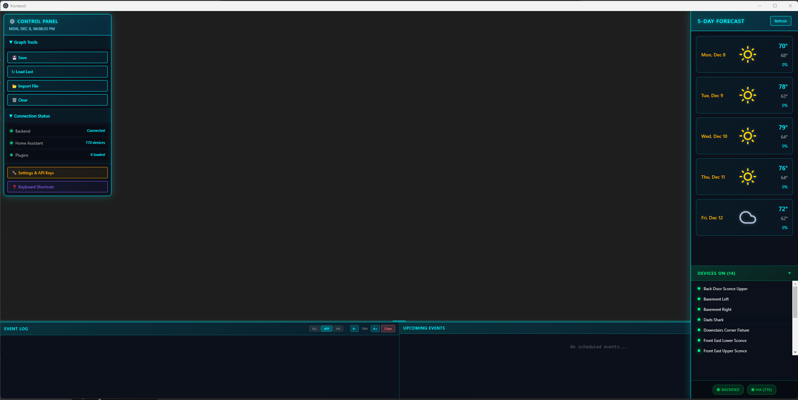
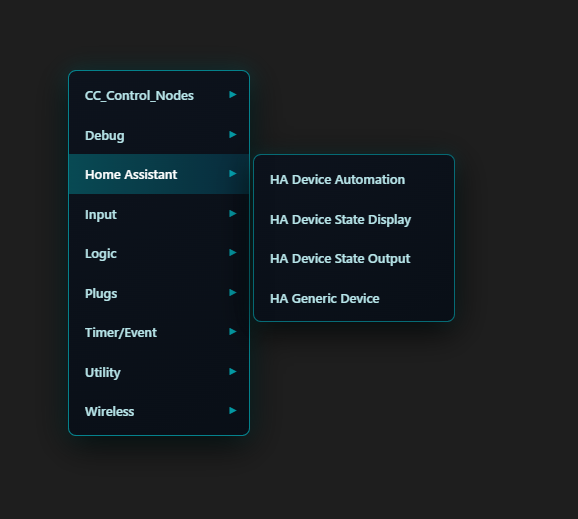
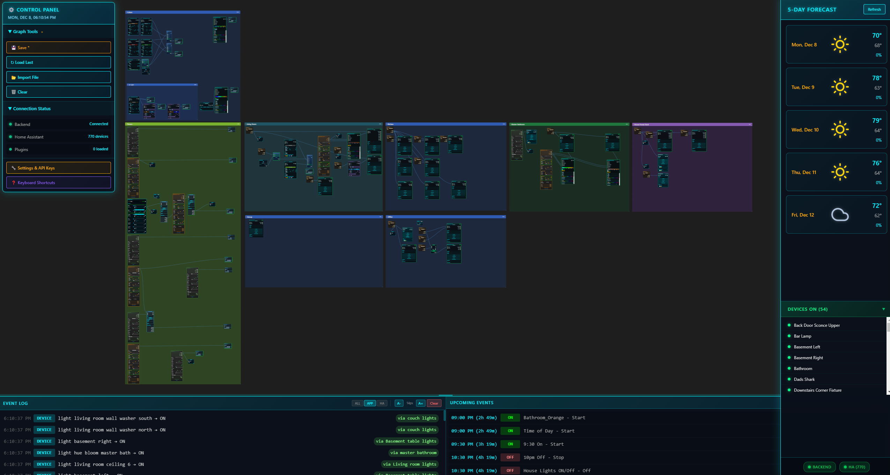
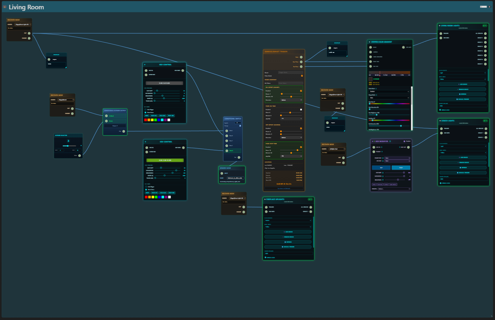
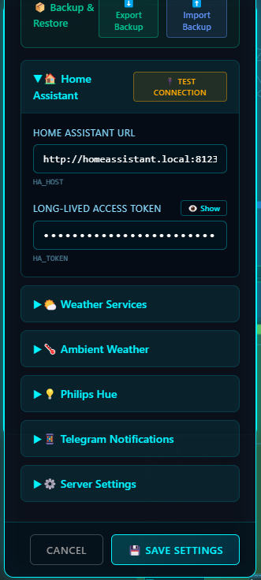

# T2AutoTron 2.1

[](LICENSE)
[](https://github.com/gregtee2/T2AutoTron/releases)
[](https://open.vscode.dev/gregtee2/T2AutoTron)

**Visual node-based smart home automation editor with a 24/7 backend engine** - your automations run even when you close the browser!



---

## 🤔 Why T2AutoTron?

Back in 2003, I got into home automation. Every app I found was menu-driven - you'd click through screens to set up rules, but you couldn't *see* the logic flow. As a visual effects artist running **Nuke** (a node-based compositing tool), I kept thinking: *"Why can't I just connect device nodes, trigger nodes, and logic nodes together?"*

Nothing like that existed, and I wasn't a programmer. Fast forward 20 years - LLMs changed everything. I could finally design the app I'd always wanted while AI handled the code.

**T2AutoTron is that app.** A visual-first automation editor where you *see* your automations flow in real-time.

### Not a Node-RED Replacement - A Visual Alternative

| | T2AutoTron | Node-RED |
|-|-----------|----------|
| **Philosophy** | See data flow live on nodes | Debug via text sidebar |
| **Learning curve** | Lower - no msg.payload | Steeper |
| **Color tools** | Built-in HSV, timelines, Oklab | Manual setup |
| **Home Automation** | Purpose-built for HA | General-purpose |
| **Execution** | 24/7 backend engine | Flow-based |

### Why Share This?

I'm sure there are others who'd appreciate a visual approach. But this is **beta software** - I need testers! Click the 🐛 **Report Bug** button in the app to help make it better.

---

## ✨ Features

### Core Platform
- 🎨 **Visual Node Editor** - Drag-and-drop automation building with Rete.js
- ⚡ **24/7 Backend Engine** - Automations run on the server, not in your browser
- 🔄 **Sync-on-Close** - Graph auto-syncs when you switch tabs or close browser
- 💾 **Auto-Save** - Every 2 minutes to prevent work loss
- ⭐ **Favorites Panel** - Drag nodes to favorites for quick access
- 📷 **Camera Panel** - View IP camera streams (MJPEG/snapshot)

### Device Support
- 🏠 **Home Assistant** – All entities (lights, switches, sensors, media players, climate, etc.)
- 💡 **Philips Hue** – Direct bridge API + built-in effects (candle, fire, prism, sparkle, etc.)
- 🔌 **TP-Link Kasa** – Direct local API (no cloud, no HA required)
- 🏠 **Shelly** – Via Home Assistant integration

### Color & Lighting (VFX-Inspired)
- 🎨 **All-in-One Color Node** - Full color control with:
  - **Kelvin Slider** (2000K-10000K) - Real-world light temperatures
  - **TMI Color Grading** - Temperature/Tint like Nuke's Grade node
  - **RGB/HSV Sliders** - All bidirectionally synced
- 🌈 **Spline Timeline Color** - Time-based color gradients with custom spline curves
- 🔬 **Oklab Color Space** - Perceptually uniform color interpolation (no muddy browns!)
- ✨ **Hue/Wiz Effect Nodes** - Trigger built-in light effects with multi-light selection

### 60+ Node Types

| Category | Nodes |
|----------|-------|
| **Home Assistant** | HA Generic Device, HA Device Automation, HA Sensor, **HA Thermostat** |
| **Timer/Event** | Sunrise/Sunset, Time of Day, Time Range, Day of Week, Date Comparison, Delay, Debounce, Retriggerable |
| **Logic** | AND, OR, NOT, XOR, NAND, NOR, Compare, Threshold, Conditional Switch, Priority Encoder, Latch, Toggle |
| **Color** | All-in-One Color, HSV Control, HSV Modifier, Spline Timeline Color, Color Gradient |
| **Inputs** | Toggle, Number Slider, Trigger Button, Inject |
| **Utility** | Sender/Receiver, Display, Counter, Math, Random, Stock Price, Debug |
| **Effects** | Hue Effect, Wiz Effect |
| **Direct Devices** | Hue Light, Hue Group, Kasa Light, Kasa Plug |

### Developer & Debug Tools
- 🔍 **Debug Dashboard** - Compare engine state vs actual device state with color timeline
- 🐛 **Report Bug Button** - One-click GitHub issue with auto-filled debug info
- 📊 **Device Timeline** - Visual history showing what color each light was at any time
- 🔧 **Hot Plugin Updates** - Add new nodes without rebuilding
- 🎯 **Group Navigation** - Quick-jump buttons to zoom to Backdrop groups

---

## 📦 Installation Options

| Option | Best For | Install Time |
|--------|----------|--------------|
| **🏠 Home Assistant Add-on** | HA users who want everything in one place | 5-10 min |
| **🖥️ Desktop App** | Standalone use, development, non-HA users | 1-2 min |

---

## 🏠 Option 1: Home Assistant Add-on

Run T2AutoTron directly inside Home Assistant - no separate computer needed!

### Quick Install

1. **Add the repository** to Home Assistant:
   - Go to **Settings** → **Add-ons** → **Add-on Store**
   - Click the **⋮** menu → **Repositories**
   - Add: `https://github.com/gregtee2/home-assistant-addons`

2. **Find "T2AutoTron"** in the add-on store and click **Install**

3. **Wait for build** (5-10 minutes on Raspberry Pi)

4. **Start the add-on** and click **Open Web UI**

That's it! Your automations now run 24/7 on your HA server.

📖 [Full add-on documentation](https://github.com/gregtee2/home-assistant-addons)

---

## 🖥️ Option 2: Desktop App (Windows/Mac/Linux)

### Step 1: Download

**Option A: ZIP Download (Easiest)**
1. Download: [T2AutoTron-stable.zip](https://github.com/gregtee2/T2AutoTron/archive/refs/heads/stable.zip)
2. Extract to a folder (e.g., `C:\T2AutoTron`)

**Option B: Git Clone (For Developers)**
```bash
git clone https://github.com/gregtee2/T2AutoTron.git
cd T2AutoTron
```

### Step 2: Install

**Windows:** Double-click `install.bat`

**Mac/Linux:**
```bash
chmod +x install.sh && ./install.sh
```

> ⏱️ First install takes 1-2 minutes. Node.js is installed automatically if needed.

### Step 3: Run

**Windows:** Double-click `start_servers.bat`

**Mac/Linux:**
```bash
./start_servers.sh
```

The app opens in an Electron desktop window.

### Step 4: Configure

1. Click the **⚙️ Settings** gear icon
2. Enter your **Home Assistant URL** (e.g., `http://homeassistant.local:8123`)
3. Enter your **Home Assistant Token** ([How to get a token](https://www.home-assistant.io/docs/authentication/#your-account-profile))
4. Click **Test Connection** → should show green checkmark
5. Click **Save**

### Step 5: Update (Anytime)

**Windows:** Double-click `update.bat`

**Mac/Linux:**
```bash
./update.sh
```

> 🔄 Works like ComfyUI - one click to update!

---

## 📁 File Reference

| File | Purpose |
|------|---------|
| `install.bat` / `install.sh` | One-click installer (installs Node.js + dependencies) |
| `start_servers.bat` / `start_servers.sh` | **Recommended** - Launches backend + Electron app |
| `start.bat` / `start.sh` | Alternative - Launches backend + browser |
| `update.bat` / `update.sh` | One-click updater |

---

## 🎨 Screenshots

### Visual Node Editor
Build automations by connecting nodes visually - no coding required.



### Automation Flows
Create complex automations with visual flows connecting triggers, logic, and device control.



### Organize with Backdrops
Group related nodes into zones for better organization.



### Settings & API Keys
Configure all your integrations in one place with connection testing.



---

## 🏗️ Architecture

```
┌─────────────────────────────────────────────────────────────────┐
│                    SHARED LOGIC LAYER                           │
│              (38 pure calculation functions)                    │
│   TimeRange • LogicGates • Color/Oklab • Delay • Utility        │
└─────────────────────────────────────────────────────────────────┘
           ↓                                    ↓
┌─────────────────────┐            ┌─────────────────────────────┐
│  FRONTEND (Browser) │            │    BACKEND ENGINE (24/7)    │
│  Rete.js Editor     │◄──────────►│    Node.js + Socket.IO      │
│  React Components   │   Sync     │    Device Managers          │
│  Visual Graph       │            │    REST API                 │
└─────────────────────┘            └─────────────────────────────┘
```

- **Rete.js v3**: Modern visual programming framework
- **React Components**: All nodes are React components with state management
- **24/7 Backend Engine**: Server-side execution - 100% frontend node coverage
- **Shared Logic Layer**: Same math runs on frontend AND backend
- **Vite Build System**: Fast development with HMR
- **Plugin Architecture**: Add new nodes without rebuilding

---

## 🔧 Development

### Manual Setup (For Developers)

```bash
# Clone the repo
git clone https://github.com/gregtee2/T2AutoTron.git
cd T2AutoTron

# Install dependencies
cd v3_migration/backend && npm install
cd ../frontend && npm install

# Create environment config
cd ../backend
cp .env.example .env  # Edit with your settings

# Start servers (two terminals)
cd v3_migration/backend && npm start    # Terminal 1: Backend on port 3000
cd v3_migration/frontend && npm run dev  # Terminal 2: Frontend on port 5173
```

### Build for Production
```bash
cd v3_migration/frontend
npm run build
# Copy dist/* to backend/frontend/
```

### Debug Mode

Debug logging is disabled by default. To enable:
- **Backend**: Set `VERBOSE_LOGGING=true` in `v3_migration/backend/.env`
- **Frontend**: Set `EDITOR_DEBUG = true` in `Editor.jsx`

---

## 📚 Documentation

- 📖 [Getting Started Guide](v3_migration/GETTING_STARTED.md) - Step-by-step tutorial
- 🔧 [Node Development Guide](v3_migration/frontend/RETE_NODE_GUIDE.md) - Create custom nodes
- 🧩 [Plugin Architecture](v3_migration/PLUGIN_ARCHITECTURE.md) - Extend T2AutoTron
- 🏗️ [Backend Engine Plan](v3_migration/backend/src/engine/BACKEND_ENGINE_PLAN.md) - Server-side execution

---

## 🔗 Links & Community

- 🐛 [Issues & Feature Requests](https://github.com/gregtee2/T2AutoTron/issues)
- 💬 [Discussions](https://github.com/gregtee2/T2AutoTron/discussions)
- 📋 [Changelog](CHANGELOG.md)

---

## 🆕 Recent Highlights (January 2026)

### v2.1.236 - Thermostat Control 🌡️
- **HAThermostatNode** - Control Nest, Ecobee, and any HA climate entity
- **Visual Temperature Ring** - See current/target temps at a glance
- **Mode Buttons** - Off/Heat/Cool/Auto with one click
- **Full Automation** - Connect inputs to automate setpoints and modes
- **Backend Support** - Works 24/7 even when browser is closed

### v2.1.235 - Color Grading Overhaul
- **Kelvin Slider** - Real-world light temperatures (2000K-10000K)
- **TMI Color Grading** - Nuke-style Temperature/Tint sliders
- **Additive Color Math** - Both axes work independently

### v2.1.234 - Oklab Color Space
- **Perceptually Uniform Gradients** - Red→Green goes through vibrant yellows, not muddy browns
- **Shared Logic Layer** - 38 pure functions used by both frontend and backend

### v2.1.212 - Debug Dashboard Enhancements
- **Device Timeline Colors** - See actual light colors over time
- **Split Bar Comparison** - Engine vs HA actual color with mismatch indicator
- **Priority Encoder Node** - Outputs index of first TRUE input

### v2.1.207 - Effect Node Fixes
- **Hue/Wiz Effect Restore** - No longer turns lights ON when effect ends
- **Proper State Handoff** - Effect nodes only clear effect, don't override on/off

### v2.1.189 - Reliability Improvements  
- **Sync-on-Close** - Graph syncs when you switch tabs (uses visibilitychange)
- **Heartbeat System** - Backend knows when frontend is active

See [CHANGELOG.md](CHANGELOG.md) for full history.

---

## ✅ Roadmap

### Complete
- [x] 60+ node types with full backend coverage
- [x] 24/7 backend engine with frontend sync
- [x] Visual color tools (HSV, Oklab, TMI, Kelvin)
- [x] Debug dashboard with device timeline
- [x] Hue/Wiz effect nodes
- [x] Plugin architecture with hot reload
- [x] Settings UI with connection testing

### In Progress
- [ ] Mobile-responsive UI
- [ ] Additional direct device support (LIFX, WLED)

### Planned
- [ ] Community node sharing
- [ ] Cloud backup option
- [ ] PWA/Mobile app

---

## 🙏 Credits

Built with:
- [Rete.js v3](https://retejs.org/) - Visual programming framework
- [React](https://react.dev/) - UI components
- [Vite](https://vitejs.dev/) - Build system
- [Home Assistant](https://www.home-assistant.io/) - Smart home platform
- [Oklab](https://bottosson.github.io/posts/oklab/) - Perceptual color space

---

**Keywords:** `home-automation` `node-editor` `smart-home` `home-assistant` `iot` `react` `retejs` `visual-programming` `automation` `philips-hue` `kasa` `color-grading`
