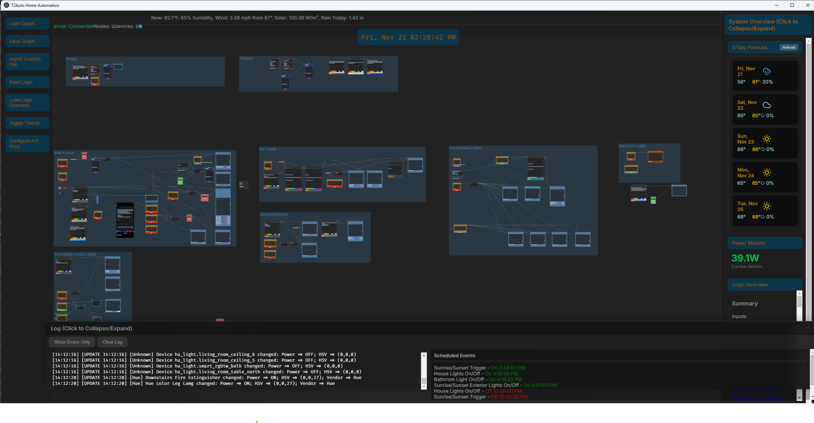
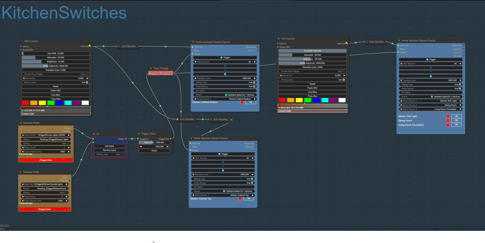
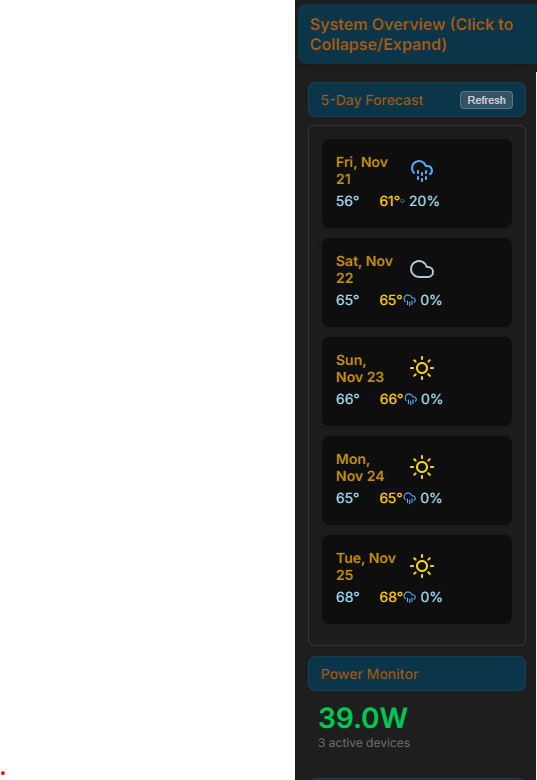
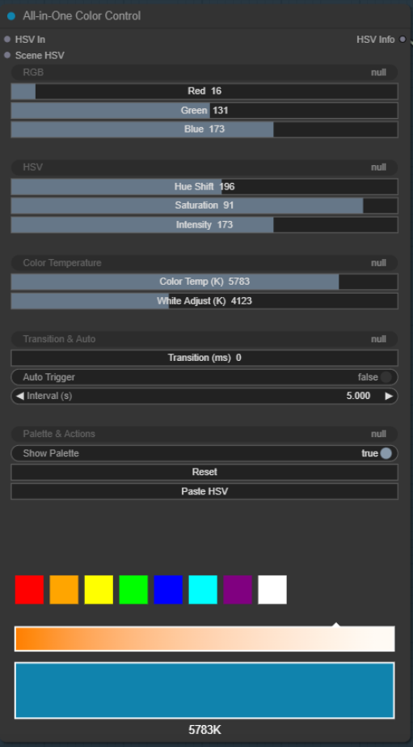
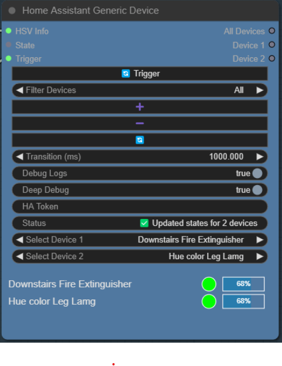
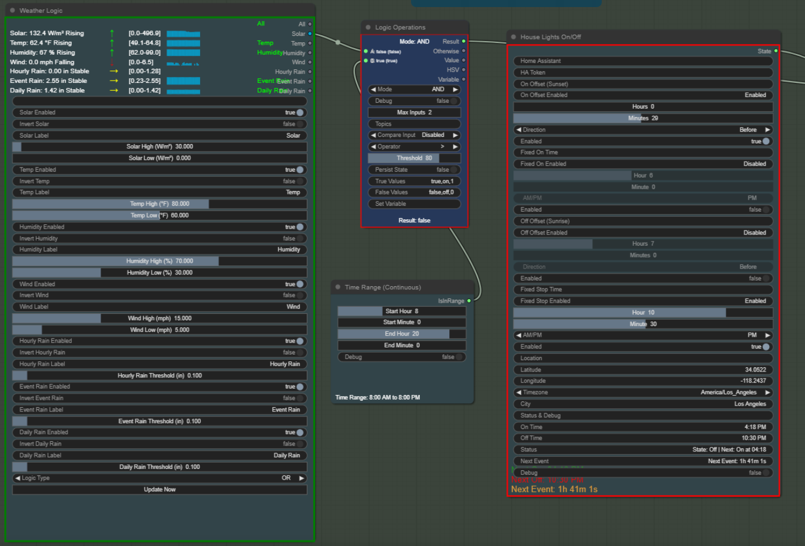

# T2AutoTron: The Visual Command Center for Your Smart Home

**T2AutoTron is your home's universal translator and command center for smart devices.**

Imagine you have lights from Philips Hue, smart plugs from TP-Link Kasa, switches from Shelly, and devices connected to Home Assistant—all speaking different "languages" and controlled by separate apps. T2AutoTron brings them all together into one powerful, visual interface.



## 🚀 Why T2AutoTron?

**The Problem:** Modern smart homes are fragmented. Each brand has its own app, its own rules, and they don't talk to each other well. Setting up automations often requires technical knowledge or expensive proprietary hubs.

**The Solution:** T2AutoTron leverages **Home Assistant** as its device integration layer, then adds:
- **Visual Programming Interface:** Connect "nodes" like LEGO blocks to create complex logic (no coding required!).
- **Real-time Energy Monitoring:** See exactly how much power your devices are using right now.
- **Universal Control:** Control Hue, Kasa, Shelly, and any Home Assistant device from one place.
- **Local Operation:** Runs on your local network for privacy and speed.

**Think of it as:** *Mission Control for your smart home, with the power of a programming language but the simplicity of connecting dots.*

## 📸 Screenshots

### Visual Logic Flow

*Complex automation logic built with simple drag-and-drop nodes*

### Weather Integration

*5-day forecast with sun times for automation triggers*

### Advanced Color Control

*Professional HSV color picker for precise lighting control*

### Home Assistant Integration

*Seamless integration with Home Assistant devices*

### Weather & Sun Logic Nodes

*Use weather conditions and sun times to trigger automations*

## ✨ Key Features

*   **Visual Logic Editor:** Drag-and-drop nodes to create automations. Want to turn on the porch light at sunset? Just connect a "Sun" node to a "Light" node.
*   **Real-Time Feedback:** Toggle a switch on your wall, and the app updates instantly.
*   **Energy Dashboard:** Track power consumption across all your smart plugs and devices.
*   **Weather Integration:** Built-in weather forecasts and triggers.
*   **Advanced Color Control:** Professional-grade HSV color tools for your smart lights.

## 🛠️ Getting Started

### Prerequisites
*   **Node.js:** Installed on your machine.
*   **Home Assistant:** Running on your network (recommended for full device support).
*   **Smart Devices:** Philips Hue, TP-Link Kasa, Shelly, etc.

### Installation

1.  **Clone the Repository:**
    ```bash
    git clone https://github.com/gregtee2/T2AutoTron.git
    cd T2AutoTron
    ```

2.  **Install Dependencies:**
    ```bash
    npm install
    ```

3.  **Configure Environment:**
    *   Rename `.env.example` to `.env`.
    *   Add your Home Assistant URL and Token (see `T2AutoTron_Complete_Documentation.md` for details).

4.  **Start the System:**
    *   **Windows:** Double-click `start_servers.bat`.
    *   **Manual:** Run `npm start`.

5.  **Access the Dashboard:**
    Open your browser and go to `http://localhost:8081`.

## 📚 Documentation

For deep dives into how the system works, check out the documentation included in this repo:

*   **[Complete System Documentation](T2AutoTron_Complete_Documentation.md):** Executive summary, architecture overview, and core components.
*   **[Technical Details](T2AutoTron_Technical_Details.md):** Deep dive into the code, managers, and data flow.
*   **[Energy Meter Guide](ENERGY_METER_GUIDE.md):** How to set up and use the energy monitoring features.

## 🏗️ Architecture

T2AutoTron is built on a modern, performance-focused stack:
*   **Backend:** Node.js, Express, Socket.IO, MongoDB.
*   **Frontend:** Vanilla JavaScript with LiteGraph.js for the visual editor.
*   **Integration:** Home Assistant API for universal device support.

## 🤝 Contributing

Contributions are welcome! Whether it's a new node type, a bug fix, or a documentation update, feel free to open a Pull Request.

## 📄 License

[MIT License](LICENSE)
