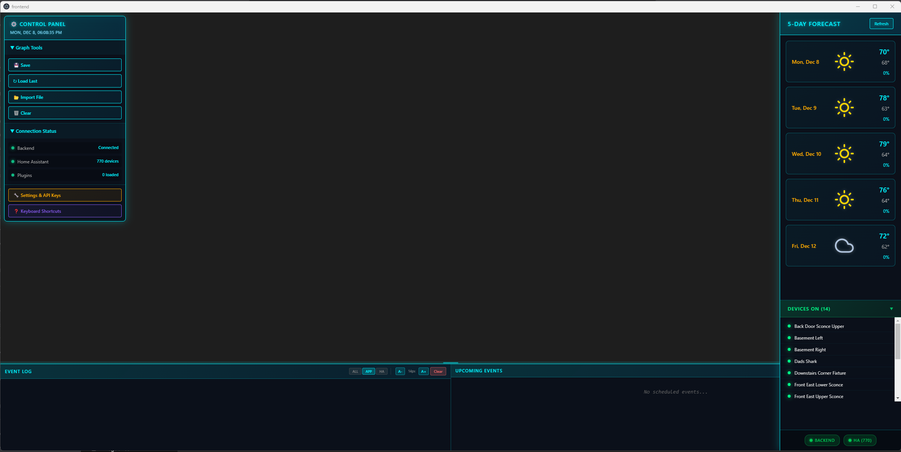
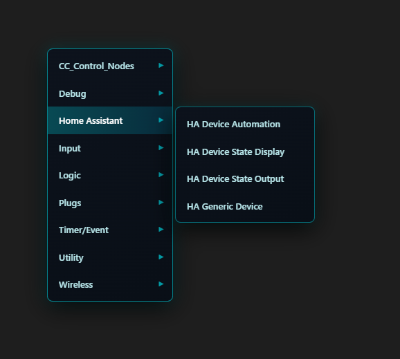
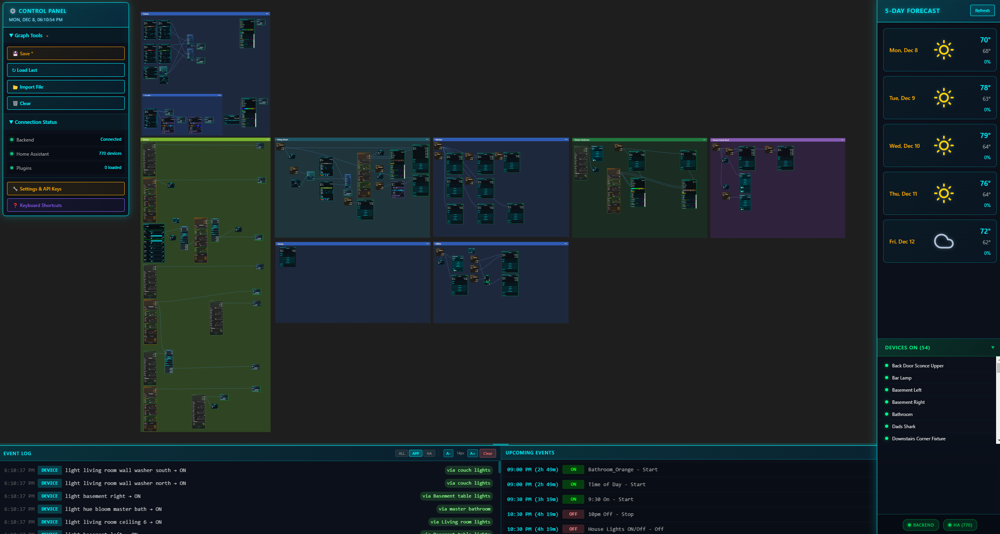
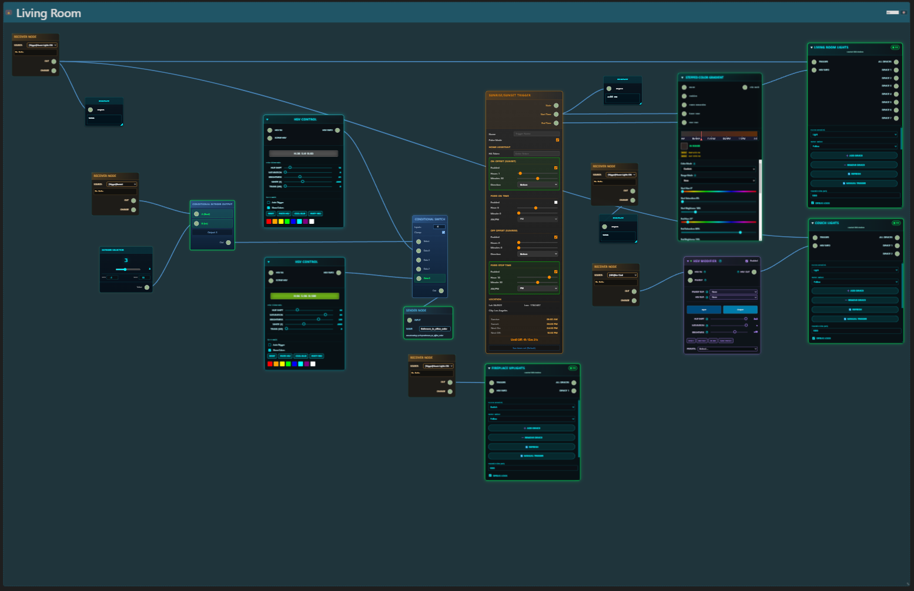
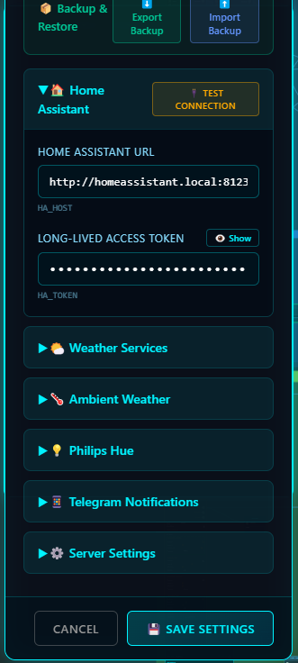

# T2AutoTron 2.1

[](v3_migration/backend/package.json)
[](CHANGELOG.md)
[](https://open.vscode.dev/gregtee2/T2AutoTron)

**Visual node-based smart home automation editor with a 24/7 backend engine** - your automations run even when you close the browser!



---

## 🤔 Why T2AutoTron?

Back in 2003, I got into home automation. Every app I found was menu-driven - you'd click through screens to set up rules, but you couldn't *see* the logic flow. As a visual effects artist running **Nuke** (a node-based compositing tool), I kept thinking: *"Why can't I just connect device nodes, trigger nodes, and logic nodes together?"*

Nothing like that existed, and I wasn't a programmer. Fast forward 20 years - LLMs changed everything. I could finally design the app I'd always wanted while AI handled the code.

**T2AutoTron is that app.** A visual-first automation editor where you *see* your automations flow in real-time.

### Not a Node-RED Replacement - A Visual Alternative

| | T2AutoTron | Node-RED |
|-|-----------|----------|
| **Philosophy** | See data flow live on nodes | Debug via text sidebar |
| **Learning curve** | Lower - no msg.payload | Steeper |
| **Color tools** | Built-in HSV, timelines, Oklab | Manual setup |
| **Home Automation** | Purpose-built for HA | General-purpose |
| **Execution** | 24/7 backend engine; browser only needed for editing | 24/7 Node.js runtime |

### Why Share This?

I'm sure there are others who'd appreciate a visual approach. But this is **beta software** - I need testers! Click the 🐛 **Report Bug** button in the app to help make it better.

---

## ✨ Features

### Core Platform
- 🎨 **Visual Node Editor** - Drag-and-drop automation building with Rete.js
- ⚡ **24/7 Backend Engine** - Automations keep running on the server when the browser is closed
- 🔄 **Editor/Engine Handoff** - The open editor controls devices; the backend takes over automatically about 30 seconds after the browser goes away
- 💾 **Auto-Save & Sync-on-Close** - Saves every 2 minutes and syncs when you switch tabs
- ⭐ **Favorites Panel** - Drag nodes to favorites for quick access
- 🎯 **Group Navigation** - Quick-jump buttons to zoom to Backdrop groups
- 🌦️ **Forecast Panel** - Live weather and 5-day forecast in °F with °C alongside
- 📅 **Upcoming Events** - See what your timers will do next
- 📷 **Camera Panel** - Live RTSP camera grid (1×1 to 4×4) via FFmpeg, with pop-out windows
- 🗣️ **Chatterbox TTS** - Optional local GPU text-to-speech for announcements, run on your desktop through the Local Agent

### Understand Your Automations
- 🧭 **Automation Trace** - Every device command with its source node, what was requested, and what Home Assistant confirmed. Filter by Completed, Waiting, or Observed, and click a source to jump to its node.
- 🗺️ **Trace Map** - Zoom to everything feeding a node, including dashed links for wireless Sender/Receiver channels
- 🩺 **Graph Health** - Flags common wiring problems (missing wireless senders, several nodes writing to one device, incompatible sockets, missing HA devices) and outlines the affected nodes
- 📜 **Event Log** - One entry per real device change, labeled as app-driven or external (physical switch, HA automation, and so on)

### Device Support
- 🏠 **Home Assistant** – Lights, switches, locks, climate, media players, sensors, and more
- 💡 **Philips Hue** – Direct bridge API, plus Hue and WiZ effect nodes (candle, fire, prism, sparkle, etc.) through Home Assistant
- 🔌 **TP-Link Kasa** – Direct local API (no cloud, no HA required)
- 🏠 **Shelly** – Via Home Assistant integration

### Color & Lighting (VFX-Inspired)
- 🎨 **All-in-One Color Control** - One node for:
  - **Kelvin slider** (2000K–10000K) for real-world light temperatures
  - **Color balance** - Temperature (warm/cool) and Tint (green/magenta) sliders that round-trip exactly with the RGB sliders
  - **RGB, saturation, and brightness** sliders kept in sync, with a live color preview and hex readout
- 🌈 **Timeline Color** - Time-based color gradients with custom spline curves
- 🔬 **Oklab Interpolation** - Perceptually uniform gradients (no muddy browns!)
- ✨ **Hue/WiZ Effect Nodes** - Trigger built-in light effects with multi-light selection

### 60+ Node Types

| Category | Nodes |
|----------|-------|
| **Home Assistant** | HA Generic Device, HA Device Automation, HA Device Field, HA Device State Display, HA Device State Output, HA Lock Control, HA Thermostat, Hue Effect, WiZ Effect |
| **Timer/Event** | Sunrise/Sunset Trigger, Time of Day, Delay (delay, debounce, throttle, retriggerable), Trigger, Inject, TTS Message Scheduler |
| **Logic** | AND Gate, OR Gate, XOR Gate, Logic Operations, Logic Condition, Comparison, Conditional Switch, Conditional Integer Output, Switch, Priority Encoder, Hysteresis, Edge Detector, Filter, State Machine, Watchdog, Time Range (Continuous), Day of Week Comparison, Date Comparison |
| **Color** | All-in-One Color Control, HSV Control, HSV Modifier, Timeline Color, Stepped Color Gradient |
| **Inputs** | Toggle, Integer Selector, Stock Price |
| **Media** | Audio Output, Event Announcer, Station Schedule, Station Selector |
| **Weather** | Weather Logic |
| **Wireless** | Sender, Receiver |
| **Utility** | Backdrop, Change, Combine, Counter, Debug, Display, Random, Smooth, Spline Value, String Concat, Text String, Sub-Graph |
| **Direct Devices** | Hue Lights, Kasa Lights, Kasa Plug Control |

### Developer & Debug Tools
- 🔍 **Debug Dashboard** - Compare engine state vs actual device state with color timeline
- 🐛 **Report Bug Button** - One-click GitHub issue with auto-filled debug info
- 📊 **Device Timeline** - Visual history showing what color each light was at any time
- 🔧 **Hot Plugin Updates** - Add new nodes without rebuilding

---

## 📦 Installation Options

| Option | Best For | Install Time |
|--------|----------|--------------|
| **🏠 Home Assistant Add-on** | HA users who want everything in one place | 5-10 min |
| **🖥️ Desktop App** | Standalone use, development, non-HA users | 1-2 min |

---

## 🏠 Option 1: Home Assistant Add-on

Run T2AutoTron directly inside Home Assistant - no separate computer needed!

### Quick Install

1. **Add the repository** to Home Assistant:
   - Go to **Settings** → **Add-ons** → **Add-on Store**
   - Click the **⋮** menu → **Repositories**
   - Add: `https://github.com/gregtee2/home-assistant-addons`

2. **Find "T2AutoTron"** in the add-on store and click **Install**

3. **Wait for build** (5-10 minutes on Raspberry Pi)

4. **Start the add-on** and click **Open Web UI**

That's it! Your automations now run 24/7 on your HA server.

📖 [Full add-on documentation](https://github.com/gregtee2/home-assistant-addons)

---

## 🖥️ Option 2: Desktop App (Windows/Mac/Linux)

### Step 1: Download

**Option A: ZIP Download (Easiest)**
1. Download: [T2AutoTron-stable.zip](https://github.com/gregtee2/T2AutoTron/archive/refs/heads/stable.zip)
2. Extract to a folder (e.g., `C:\T2AutoTron`)

**Option B: Git Clone (For Developers)**
```bash
git clone https://github.com/gregtee2/T2AutoTron.git
cd T2AutoTron
```

### Step 2: Install

**Windows:** Double-click `install.bat`

**Mac/Linux:**
```bash
chmod +x install.sh && ./install.sh
```

> ⏱️ First install takes 1-2 minutes. Node.js is installed automatically if needed.

### Step 3: Run

**Windows:** Double-click `start_servers.bat` (opens the Electron desktop window)

**Mac/Linux:**
```bash
./start.sh
```

This starts the backend and frontend and opens `http://localhost:5173` in your browser.

### Step 4: Configure

1. Click the **⚙️ Settings** gear icon
2. Enter your **Home Assistant URL** (e.g., `http://homeassistant.local:8123`)
3. Enter your **Home Assistant Token** ([How to get a token](https://www.home-assistant.io/docs/authentication/#your-account-profile))
4. Click **Test Connection** → should show green checkmark
5. Click **Save**

### Step 5: Update (Anytime)

**Windows:** Double-click `update.bat`

**Mac/Linux:**
```bash
./update.sh
```

> 🔄 Works like ComfyUI - one click to update!

---

## 📁 File Reference

| File | Purpose |
|------|---------|
| `install.bat` / `install.sh` | One-click installer (installs Node.js + dependencies) |
| `start_servers.bat` | **Windows (recommended)** - Launches backend + Electron app |
| `start.bat` / `start.sh` | Launches backend + frontend in the browser (`start.sh` is the Mac/Linux launcher) |
| `update.bat` / `update.sh` | One-click updater |

---

## 🎨 Screenshots

### Visual Node Editor
Build automations by connecting nodes visually - no coding required.



### Automation Flows
Create complex automations with visual flows connecting triggers, logic, and device control.



### Organize with Backdrops
Group related nodes into zones for better organization.



### Settings & API Keys
Configure all your integrations in one place with connection testing.



---

## 🏗️ Architecture

```
┌─────────────────────────────────────────────────────────────────┐
│                    SHARED LOGIC LAYER                           │
│              (pure calculation functions)                       │
│   TimeRange • LogicGates • Color/Oklab • Delay • Utility        │
└─────────────────────────────────────────────────────────────────┘
           ↓                                    ↓
┌─────────────────────┐            ┌─────────────────────────────┐
│  FRONTEND (Browser) │            │    BACKEND ENGINE (24/7)    │
│  Rete.js Editor     │◄──────────►│    Node.js + Socket.IO      │
│  React Components   │   Sync     │    Device Managers          │
│  Visual Graph       │            │    REST API                 │
└─────────────────────┘            └─────────────────────────────┘
```

- **Rete.js v2 + React 19**: Visual programming framework with React-rendered nodes
- **24/7 Backend Engine**: Server-side execution of automation nodes (display-only nodes such as Display and Backdrop run in the editor only)
- **Shared Logic Layer**: Same math runs on frontend AND backend
- **Vite 7 Build System**: Fast development with HMR
- **Plugin Architecture**: Add new nodes without rebuilding

---

## 🔧 Development

### Manual Setup (For Developers)

```bash
# Clone the repo
git clone https://github.com/gregtee2/T2AutoTron.git
cd T2AutoTron

# Install dependencies
cd v3_migration/backend && npm install
cd ../frontend && npm install

# Start servers (two terminals)
cd v3_migration/backend && npm start    # Terminal 1: Backend on port 3000
cd v3_migration/frontend && npm run dev  # Terminal 2: Frontend on port 5173

# Configure: open ⚙️ Settings in the app and enter your HA URL and token.
# Settings writes v3_migration/backend/.env for you.
```

### Build for Production
```bash
cd v3_migration/frontend
npm run build
# Copy dist/* to backend/frontend/
```

### Debug Mode

Debug logging is disabled by default. To enable:
- **Backend**: Set `VERBOSE_LOGGING=true` in `v3_migration/backend/.env`
- **Frontend**: Set `EDITOR_DEBUG = true` in `Editor.jsx`

---

## 📚 Documentation

- 📖 [Getting Started Guide](v3_migration/GETTING_STARTED.md) - Step-by-step tutorial
- 🔧 [Node Development Guide](v3_migration/frontend/RETE_NODE_GUIDE.md) - Create custom nodes
- 🧩 [Plugin Architecture](v3_migration/PLUGIN_ARCHITECTURE.md) - Extend T2AutoTron
- 🏗️ [Backend Engine Plan](v3_migration/backend/src/engine/BACKEND_ENGINE_PLAN.md) - Server-side execution

---

## 🔗 Links & Community

- 🐛 [Issues & Feature Requests](https://github.com/gregtee2/T2AutoTron/issues)
- 💬 [Discussions](https://github.com/gregtee2/T2AutoTron/discussions)
- 📋 [Changelog](CHANGELOG.md)

---

## 🆕 Recent Highlights (September 2026)

### v2.1.263–2.1.265 - Trustworthy Logs & Startup
- **Accurate sources** - Automation Trace shows the real node behind each command, not "Manual control"
- **Quieter Event Log** - No duplicate reports from direct Kasa/Hue connections, startup snapshots, or room/group lights
- **No startup flicker** - Time of Day and Sunrise/Sunset nodes compute their state from the clock when a graph loads
- **No endless "waiting"** - Commands to devices already in the requested state confirm right away

### v2.1.261–2.1.262 - Color & Device Fixes
- **All-in-One Color redesign** - Live preview, hex readout, and exact RGB ↔ color balance round-trips
- **HSV Control** - Connected HSV input now passes through
- **HA Generic Device** - Deleted nodes fully stop, and 0 ms transitions stay instant
- **Forecast in °C** - Shown alongside °F

### v2.1.253–2.1.260 - See Why Things Happen
- **Automation Trace** - Command → request → HA confirmation, with status filters
- **Trace Map** - Zoom to a node's upstream logic, including wireless links
- **Graph Health** - Wiring checks with affected nodes outlined

### Earlier in 2026
- **v2.1.236** - HA Thermostat node
- **v2.1.234** - Oklab color interpolation and the shared logic layer
- **v2.1.212** - Debug Dashboard color timeline
- **v2.1.207** - Hue/WiZ effects no longer turn lights on when they end
- **v2.1.189** - Sync-on-close and heartbeat handoff

See [CHANGELOG.md](CHANGELOG.md) for full history.

---

## ✅ Roadmap

### Complete
- [x] 60+ node types, with backend engine support for automation nodes
- [x] 24/7 backend engine with frontend sync
- [x] Visual color tools (HSV, Oklab, color balance, Kelvin)
- [x] Automation Trace, Trace Map, and Graph Health
- [x] Debug dashboard with device timeline
- [x] Hue/WiZ effect nodes
- [x] Live RTSP camera grid
- [x] Plugin architecture with hot reload
- [x] Settings UI with connection testing

### In Progress
- [ ] Mobile-responsive UI
- [ ] Additional direct device support (LIFX, WLED)

### Planned
- [ ] Community node sharing
- [ ] Cloud backup option
- [ ] PWA/Mobile app

---

## Recovery Notes

- [HA Generic Device command contract](v3_migration/HA_GENERIC_DEVICE_CONTRACT.md): desired versus observed state, delivery confirmation, retries, ownership handoff, and overnight acceptance tests.

---

## 🙏 Credits

Built with:
- [Rete.js v2](https://retejs.org/) - Visual programming framework
- [React](https://react.dev/) - UI components
- [Vite](https://vitejs.dev/) - Build system
- [Home Assistant](https://www.home-assistant.io/) - Smart home platform
- [Oklab](https://bottosson.github.io/posts/oklab/) - Perceptual color space

---

**Keywords:** `home-automation` `node-editor` `smart-home` `home-assistant` `iot` `react` `retejs` `visual-programming` `automation` `philips-hue` `kasa` `color-grading`
